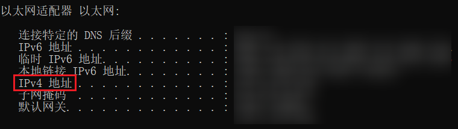
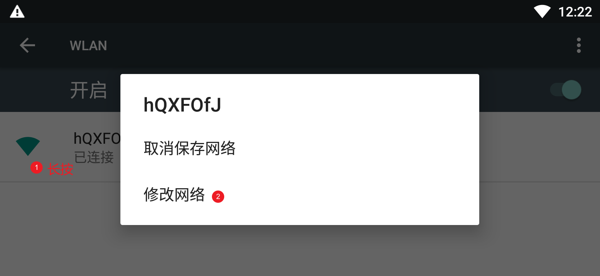
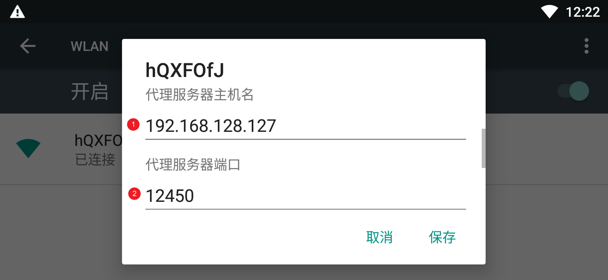
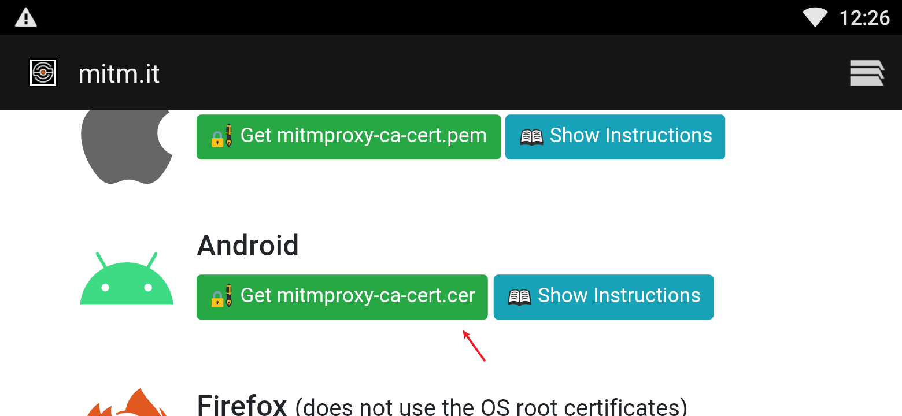
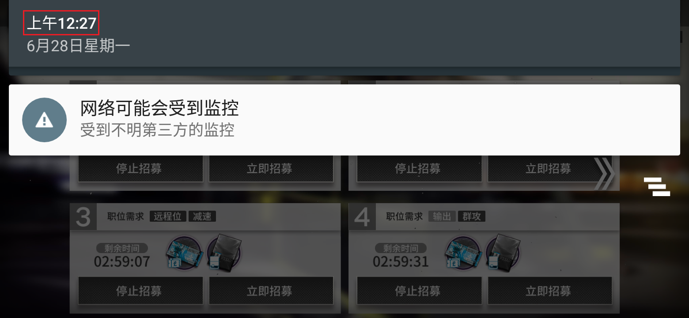

# ArkFCM
手游明日方舟绕过防沉迷限制的方法。

本方法由B站用户[Tao0Lu](https://space.bilibili.com/401343976)提出，如果好用请到原文下面点赞投币收藏：[【官服】明日方舟防沉迷破解|实现任何时间进入](https://www.bilibili.com/read/cv7795601)

这里提供一个具体的操作指南和整理好的代码，省略了关于原理的讨论。

另外，我并不打算打包成更方便的`exe`一键运行形式。因为如果太简单了会有很多人用，增加这条路被封禁的风险，所以只做了脚本形式。这也正好督促各位初高中生们学一点简单的代码。

## 首次操作

1. 安装Python；
   - [Download Python | Python.org](https://www.python.org/downloads/)
2. 安装好后，打开命令行（CMD），安装`mitmproxy`；

```shell
pip install mitmproxy
```

3. 下载本目录下的`proxy.py`（[懒人链接](https://raw.githubusercontent.com/Wenzhi-Ding/ArkFCM/main/proxy.py)，点进去之后右键另存为就行了），放在某路径下，假设为`E:\Code\2021\ArkFCM\`；
4. 在命令行中输入`ipconfig`，获取本机的局域网地址`192.168.128.127`；



5. 在命令行中运行以下指令后（注意替换文件路径）。出现`Proxy server listening at http://*:12450`表示代理启动成功。保持命令行窗口开启；

```shell
mitmdump -s "E:\Code\2021\ArkFCM\proxy.py" --ssl-insecure -p 12450
```

6. 接下来打开模拟器，进入“设置——WLAN——长按网络——修改网络”；



7. 首先将代理模式改为“手动”，然后填入第5步中所述IP地址和端口号12450；



8. 接下来用模拟器的浏览器访问`http://mitm.it`，并下载安卓对应的证书。安装的时候随便取个名字就行。



9. 至此已经全部完成，可以进入游戏了；



## 再次使用

首次配置完之后，以后每次只需要在启动游戏之前，先在命令行中运行代理即可（注意替换文件路径）。即在命令行中运行：

```shell
mitmdump -s "E:\Code\2021\ArkFCM\proxy.py" --ssl-insecure -p 12450
```

